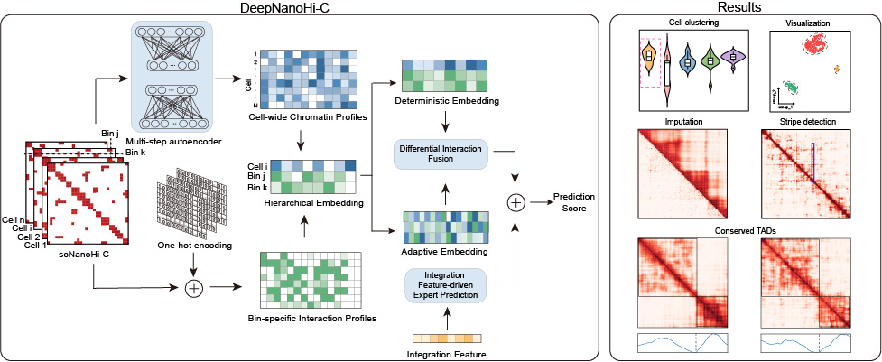

# DeepNanoHi-C

##  Overview

**DeepNanoHi-C** is a deep learning framework specifically developed for analyzing **single-cell long-read concatemer sequencing (scNanoHi-C)** data, a technology that enables high-resolution profiling of 3D chromatin structure in individual cells. Despite its potential, scNanoHi-C presents unique analytical challenges—such as sparsity, cell-specific variability, and complex chromatin interaction patterns—that are not fully addressed by existing scHi-C methods.

DeepNanoHi-C tackles these challenges through a **multi-step autoencoder architecture** combined with a **Sparse Gated Mixture-of-Experts (MoE)** model. This framework learns both global and cell-specific chromatin contact patterns, imputes sparse contact maps, and dynamically selects expert models based on distinct interaction features. It further employs a **dual-channel prediction network** to integrate multi-scale chromatin interactions and refine structural inferences.

This tool enables comprehensive and scalable analysis of single-cell chromatin conformation, providing new avenues for understanding genome organization at the single-cell level and across species.


##  Installation

To install and set up **DeepNanoHi-C**, please follow the steps below:

1. **Clone the Repository**

```bash
git clone https://github.com/your-username/DeepNanoHi-C.git
cd DeepNanoHi-C
```

2. **Create and activate the conda environment**
```bash
conda create -n deepnanohic python=3.9
conda activate deepnanohic
```

3. **Install Dependencies**

   a. Install PyTorch  
   Install PyTorch (>= 1.9.0) following the official instructions:[https://pytorch.org/get-started/locally/](https://pytorch.org/get-started/locally/).  
   We recommend using PyTorch 1.12.1.

   b. Install Required Packages
   You can install all required packages using:
   ```bash
   pip install -r requirements.txt
   ```

##  Data Preparation

To run DeepNanoHi-C, please prepare the following input files:

1. **`data.txt`**

A tab-separated file containing raw interaction records. Each row represents an interaction between two genomic bins in a single cell. The required columns are:

| Column Name | Description                          |
|-------------|--------------------------------------|
| `cell_id`   | Unique identifier of each cell       |
| `chrom1`    | Chromosome of the first fragment     |
| `pos1`      | Genomic position of the first bin    |
| `chrom2`    | Chromosome of the second fragment    |
| `pos2`      | Genomic position of the second bin   |
| `count`     | Contact count |


2. **`label_info.pickle`**

A Python pickle file (`.pickle`) that stores cell metadata, including cell type labels. It should be a dictionary with cell IDs as keys and their corresponding cell types as values.


 ```python
{
    'cell type': ['GM12878', 'GM12878', 'GM12878', ... , 'K562']
}
```


3. **`config.json`**

A JSON configuration file specifying dataset-related parameters. Some of the required keys include:

```json
{
  "data_dir": "./",
  "temp_dir": "./Temp",
  "genome_reference_path": "./hg38.chrom.sizes",
  "chrom_list": ["chr1","chr2","chr3","chr4","chr5",
			  "chr6","chr7","chr8","chr9","chr10",
			  "chr11","chr12","chr13","chr14","chr15",
			  "chr16","chr17","chr18","chr19","chr20",
			  "chr21","chr22","chrX"],
  "resolution": 10000
}
```


##  Usage Tutorial

We provide users with comprehensive usage instructions in the [`data/`](./data) folder. This includes:

- Step-by-step data preprocessing examples  
- Configuration file templates (`config.json`)  
- Instructions for feature extraction and model training  
- Clustering evaluation and downstream analysis

To help users get started quickly, we also provide demo data and example results.

Demo data is publicly available on Figshare:  
[https://figshare.com/articles/dataset/DeepNanoHi-C/28551230](https://figshare.com/articles/dataset/DeepNanoHi-C/28551230)

You can use this dataset to reproduce all major steps of the DeepNanoHi-C pipeline, including:

- Raw interaction data formatting  
- Feature extraction from contact maps  
- Training and inference using the DeepNanoHi-C model  
- Clustering evaluation and visualization
